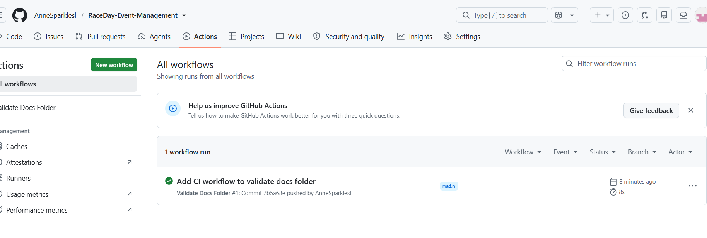

# RaceDay – Event Management System

RaceDay is a full-stack web-based event management platform built for the South African road running, walking, and cycling community. It allows Event Organisers to create and manage events, categories, and participant results, while Participants can browse upcoming events, enter events, and track their personal performance history.

This repository contains the Part 1 planning deliverables: the Entity Relationship Diagram (ERD), the API endpoint plan, and the SQL database script for the RaceDayDB schema.

## Table of Contents

- [Roles](#roles)
- [Project Structure](#project-structure)
- [Setup Instructions](#setup-instructions)
- [Design Decisions](#design-decisions)
- [CI/CD](#cicd)
- [Video Walkthrough](#video-walkthrough)

## Roles

- **Organiser** — can create, edit, and delete events, manage event categories, capture participant results, and view all event enrolments.
- **Participant** — can create an account, browse events, enter an event by selecting a category, view their own enrolments, and track their personal results.

## Project Structure

docs/
- raceday_erd.png — Entity Relationship Diagram
- api-endpoint-plan.md — Full REST API endpoint plan
- raceday_schema.sql — SQL script to create and seed RaceDayDB

## Setup Instructions

1. Open SQL Server Management Studio (SSMS) and connect to your local instance.
2. Open docs/raceday_schema.sql.
3. Run the script — it creates the RaceDayDB database, all tables with constraints, and seeds sample data (2 Organisers, 2 Participants, 3 Events, categories, and enrolments).
4. Review docs/api-endpoint-plan.md for the full planned API surface.
5. Review docs/raceday_erd.png for the data model.

## Design Decisions

- **Result is one-to-one with Enrolment** — a UNIQUE constraint on `enrolment_id` in the Result table ensures each enrolment can only have a single recorded result, preventing duplicate finish times for the same participant in the same category.
- **Role is stored on the User table** rather than as a separate Roles table — with only two fixed roles (Organiser, Participant), a CHECK constraint keeps the schema simple without sacrificing data integrity.
- **Venue is separate from Event** so the same venue can be reused across multiple events without duplicating address data.
## Assumptions and Limitations

- Password hashing (e.g. bcrypt) is assumed to be implemented at the application layer in Part 2 — the `password_hash` column simply stores the resulting hash, not plaintext passwords.
- Authentication tokens (JWT) are planned but not yet implemented, since no API code is written in Part 1.
- The current seed data is illustrative only, intended to demonstrate the schema and relationships rather than represent real event data.
## CI/CD

A GitHub Actions workflow (.github/workflows/validate-docs.yml) automatically validates that the /docs folder exists and contains all required Part 1 files on every push to main.

## Video Walkthrough

YouTube link: to be added
